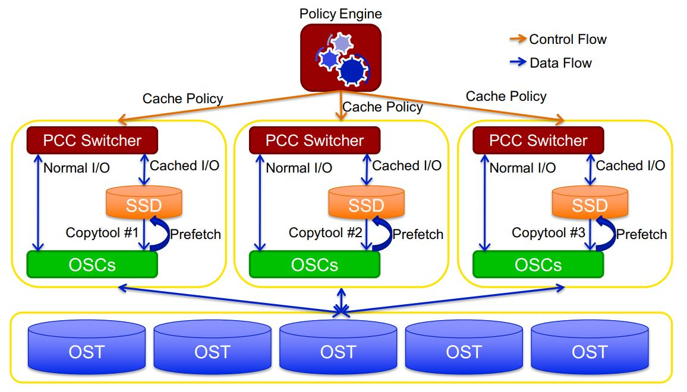

## Lustre PCC 初探

| 作者 | 时间 |QQ群 |
| ------ | ------ |------ |
| perrynzhou@gmail.com |2021/03/14 |672152841 |

####  什么是Lustre PCC?
- Lustre PCC 是Lustre  Persistent Cache on Client技术，借助客户端的挂载节点提供的HDD或者SSD来根据策略来在SSD或者HDD 和lustre文本系统之间数据缓存的技术。

#### Lustre PCC 使用什么场景

- 比如在AI训练场景中，AI训练计算在GPU节点，存储是挂载在AI计算节点的，每个计算节点读取本节点挂载的存储数据进行计算，这是一般AI训练的过程。每个计算节点都是通过网络请求去拉去后端存储的数据,如果这些计算数据可以缓存在计算节点的本地磁盘，同时这些数据可以实时异步同步到后端存储，那么计算节点就不需要请求网络去拉去后端存储的数据了，计算节点访问数据的IO协议栈相对简单，直接读取本地数据，同时可以缓解后端存储的IO压力，本地数据通过某种机制把数据sync到后端存储，这样可以提高AI存储IO效率和后端存储的数据一致性。
- 基于这样的场景，Lustre PCC就可以派上用场，它的作用就是在计算节点使用一块磁盘然后初始化为某个文件系统，然后充当lustre 挂载客户端持久化缓存，至于本地磁盘缓存数据是听过lustre一个用户态工具同步到lustre后端的ost中。


#### Lustre PCC 架构是什么样的？



#### Lustre PCC 策略有那些？

- RW-PCCM模式，读写模式访问本地lustre的缓存，缓存中的数据通过lhsmtool_posix来和后端的lustre进行数据同步。
- RO-PCC模式，以制度方式访问本地lustre的缓存，消除了LDLM和RPC的开销。


#### Lustre 启用和配置

```
// mdt节点
[root@dgdpl1915 ~]# lctl set_param mdt.lustrefs-MDT0000.hsm_control=enabled
mdt.lustrefs-MDT0000.hsm_control=enabled
[root@dgdpl1915 ~]# lctl get_param mdt.lustrefs-MDT0000.hsm_control       
mdt.lustrefs-MDT0000.hsm_control=enabled

//客户端节点
lhsmtool_posix --daemon --hsm-root /lustre/cache --archive=1 /mnt/lustre

//客户端节点
lctl pcc add /mnt/lustre  /lustre/cache  --param "uid=0 rwid=1 auto_attch=1"
```
