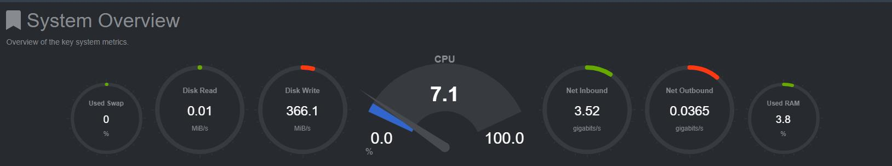

## Lustre部署

| 作者 | 时间 |QQ群 |
| ------ | ------ |------ |
| perrynzhou@gmail.com |2020/12/01 |672152841 |

### kernel版本信息

```
[root@CentOS1 ~]# cat /etc/redhat-release 
CentOS Linux release 7.7.1908 (Core)
[root@CentOS1 ~]# uname -r
3.10.0-1062.el7.x86_64
```

### 配置lustre安装源
```
// lustre-2.14.0 内核刚好匹配 kernel 3.10.0-1062.el7.x86_64
[root@CentOS1 lustre]# pwd
/root/lustre
[root@CentOS1 lustre]# ls
repo.conf
[root@CentOS1 lustre]# cat lustre.repo 
[lustre-server]
name=lustre-server
baseurl=https://downloads.whamcloud.com/public/lustre/lustre-2.14.0/el7.7.1908/server
gpgcheck=0


[patchless-ldiskfs-server]
name=patchless-ldiskfs-server
baseurl=https://downloads.whamcloud.com/public/lustre/lustre-2.14.0/el7.7.1908/patchless-ldiskfs-server
gpgcheck=0

[lustre-client]
name=lustre-client
baseurl=https://downloads.whamcloud.com/public/lustre/lustre-2.14.0/el7.7.1908/client
gpgcheck=0

[e2fsprogs-wc]
name=e2fsprogs-wc
baseurl=https://downloads.whamcloud.com/public/e2fsprogs/latest/el7
gpgcheck=0

[root@CentOS1 lustre]# cp  lustre.repo /etc/yum.repo/lustre.repo
```

- 预安装

```
[root@CentOS1 ~]# cd ~/lustre
[root@CentOS1 ~]# yum groupinstall “Development Tools” -y
[root@CentOS1 ~]# yum install epel-release quilt libselinux-devel python-docutils xmlto asciidoc elfutils-libelf-devel elfutils-devel zlib-devel rng-tools binutils-devel python-devel sg3_utils newt-devel perl-ExtUtils-Embed audit-libs-devel lsof hmaccalc -y
[root@CentOS1 ~]# systemctl stop firewalld.service
[root@CentOS1 ~]# systemctl disable firewalld.service
[root@CentOS1 lustre]# yum remove kernel-tools-libs kernel-tools kernel-headers kernel-debug-devel -y
[root@CentOS1 lustre]# yum --nogpgcheck --disablerepo=base,extras,updates \
--enablerepo=lustre-server install \
kernel \
kernel-devel \
kernel-headers \
kernel-tools \
kernel-tools-libs \
kernel-tools-libs-devel
```

### 安装lustre

```

[root@CentOS1 lustre]# yum install epel-release quilt libselinux-devel python-docutils xmlto asciidoc elfutils-libelf-devel elfutils-devel zlib-devel rng-tools binutils-devel python-devel sg3_utils newt-devel perl-ExtUtils-Embed audit-libs-devel lsof hmaccalc asciidoc audit-libs-devel automake bc binutils-devel bison device-mapper-devel elfutils-devel elfutils-libelf-devel expect flex gcc gcc-c++ git glib2 glib2-devel hmaccalc keyutils-libs-devel krb5-devel ksh ibattr-devel libblkid-devel libselinux-devel libtool libuuid-devel libyaml-devel lsscsi make ncurses-devel net-snmp-devel net-tools newt-devel numactl-devel parted patchutils pciutils-devel perl-ExtUtils-Embed pesign python-devel redhat-rpm-config rpm-build systemd-devel tcl tcl-devel tk tk-devel wget xmlto yum-utils zlib-devel linux-firmware  dkms -y 

[root@CentOS1 lustre]# yum --nogpgcheck --enablerepo=lustre-server install \
kmod-lustre-osd-ldiskfs \
lustre-dkms \
lustre-osd-ldiskfs-mount \
lustre-osd-zfs-mount \
lustre lustre-debuginfo  \
lustre-resource-agents \
zfs  zfs-debuginfo

[root@CentOS1 ~] reboot
```

### 验证lustre安装
```
[root@CentOS1 x86_64]# modprobe -v zfs
[root@CentOS1 x86_64]# modprobe -v lustre
[root@CentOS1 x86_64]# modprobe -v lnet
[root@CentOS1 x86_64]# lsmod  |grep zfs
[root@CentOS1 ~]# lsmod  |grep lustre
[root@CentOS1 ~]# lsmod  |grep lnet

```

### 三个节点分别创建MDS

```
//节点1，每台机器的mgt和mdt共享；有条件可以单独部署
wipefs -a /dev/sdg
mkdir -p /lustre/mdt
mkfs.lustre --fsname=fs00 --mgs --mdt --index=0   --backfstype=zfs --reformat mdspool/mdt /dev/sdg 
mount.lustre mdspool/mdt /lustre/mdt/

//节点2
wipefs -a /dev/sdg
mkdir -p /lustre/mdt
mkfs.lustre --fsname=fs00 --mgs --mdt --index=2   --backfstype=zfs --reformat mdspool/mdt /dev/sdg 
mount.lustre mdspool/mdt /lustre/mdt/

//节点3
wipefs -a /dev/sdg
mkdir -p /lustre/mdt
mkfs.lustre --fsname=fs00 --mgs --mdt --index=3   --backfstype=zfs --reformat mdspool/mdt /dev/sdg 
mount.lustre mdspool/mdt /lustre/mdt/
```
### 配置三个节点的ost(每台机器2个磁盘)

```
//每个节点使用zfs作为ost底层的存储

//节点1
mkdir -p /lustre/ost0
mkdir -p /lustre/ost1
wipefs -a /dev/sde
wipefs -a /dev/sdf

//每个ost的pool名称必须不同,比如ost0 的pool名称是osspool0/ost,ost1的名称是osspool/ost,其中osspool-{xx}必须不同
mkfs.lustre --ost --reformat --fsname fs00 --index 0 --mgsnode 172.16.84.43@tcp0  --mgsnode 172.16.84.44@tcp0  --mgsnode 172.16.84.45@tcp0 --backfstype zfs osspool0/ost /dev/sde 
mkfs.lustre --ost --reformat --fsname fs00 --index 1 --mgsnode 172.16.84.43@tcp0  --mgsnode 172.16.84.44@tcp0  --mgsnode 172.16.84.45@tcp0  --backfstype zfs osspool1/ost /dev/sdf 

mount.lustre osspool0/ost /lustre/ost0/
mount.lustre osspool1/ost /lustre/ost1/

//节点2

mkdir -p /lustre/ost2
mkdir -p /lustre/ost3
wipefs -a /dev/sde
wipefs -a /dev/sdf

mkfs.lustre --ost --reformat --fsname fs00 --index 2 --mgsnode 172.16.84.43@tcp0  --mgsnode 172.16.84.44@tcp0  --mgsnode 172.16.84.45@tcp0 --backfstype zfs osspool0/ost /dev/sde 
mkfs.lustre --ost --reformat --fsname fs00 --index 3 --mgsnode 172.16.84.43@tcp0  --mgsnode 172.16.84.44@tcp0  --mgsnode 172.16.84.45@tcp0  --backfstype zfs osspool1/ost /dev/sdf 

mount.lustre osspool2/ost /lustre/ost2/
mount.lustre osspool3/ost /lustre/ost3/

//节点3

mkdir -p /lustre/ost4
mkdir -p /lustre/ost5
wipefs -a /dev/sde
wipefs -a /dev/sdf

mkfs.lustre --ost --reformat --fsname fs00 --index 4 --mgsnode 172.16.84.43@tcp0  --mgsnode 172.16.84.44@tcp0  --mgsnode 172.16.84.45@tcp0 --backfstype zfs osspool0/ost /dev/sde 
mkfs.lustre --ost --reformat --fsname fs00 --index 5 --mgsnode 172.16.84.43@tcp0  --mgsnode 172.16.84.44@tcp0  --mgsnode 172.16.84.45@tcp0  --backfstype zfs osspool1/ost /dev/sdf 

mount.lustre osspool4/ost /lustre/ost4/
mount.lustre osspool5/ost /lustre/ost5/
```
### 客户端节点挂载
```
yum --nogpgcheck --enablerepo=lustre-client  install \
kmod-lustre-client \
lustre-client

 modprobe -v lustre
 mount -t lustre 172.16.84.43@tcp:172.16.84.44@tcp:172.16.84.45@tcp:/fs00 /mnt/lustre/
```

###  lustre process信息

```
//show luste mgs info
[root@CentOS1 ~]# ps -ef|grep mgs
[root@CentOS1 ~]# ps -ef|grep ost
[root@CentOS1 ~]# ps -ef|grep mdt
```

### Lustre和Glusterfs 存储写粗略带宽对比

- gluster 采用EC(4+2);lustre采用默认,相同的磁盘的情况下，lustre的写带宽是glusterfs的3倍左右。
- glusterfs EC大文件写的带宽



- lustre 大文件写的带宽

